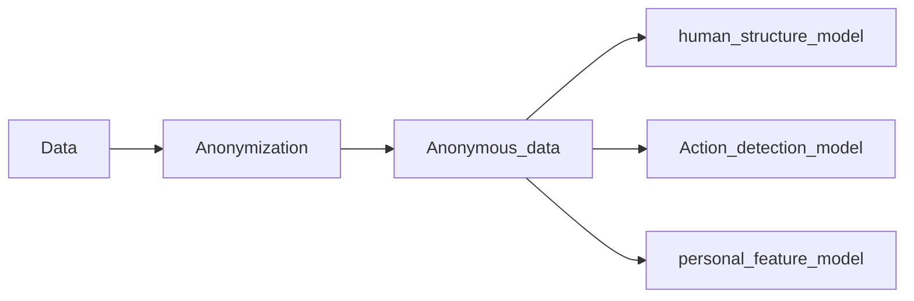

# Skeleton-anonymization

## Framework

## Dataset: NTU RGB+D
​	"NTU RGB+D" is a large-scale dataset for human action recognition. It contains 56,880 and 114,480 action samples, respectively, including 4 different modalities of data for each sample:

- RGB videos
- depth map sequences
- 3D skeletal data
- infrared (IR) videos

​	And here we use the **3D skeletal data** to realize action recongnition and feature anonymization.

​	For more information about the dataset, please refer to https://github.com/shahroudy/NTURGB-D#ntu-rgbd-action-recognition-dataset
