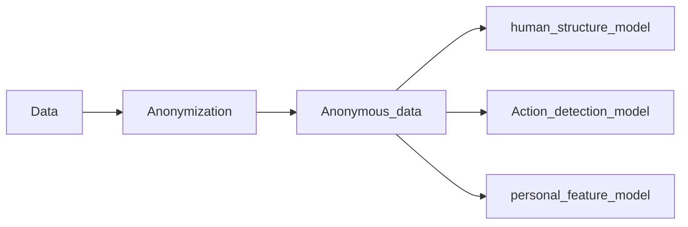

# Skeleton-anonymization

## Framework

```mermaid
graph LR;
    Data-->Anonymization;
    Anonymization-->Anonymous_data;
    Anonymous_data-->human_structure_model;
    Anonymous_data-->Action_detection_model;
    Anonymous_data-->personal_feature_model;
    
```

## Dataset: NTU RGB+D
    "NTU RGB+D" is a large-scale dataset for human action recognition.
